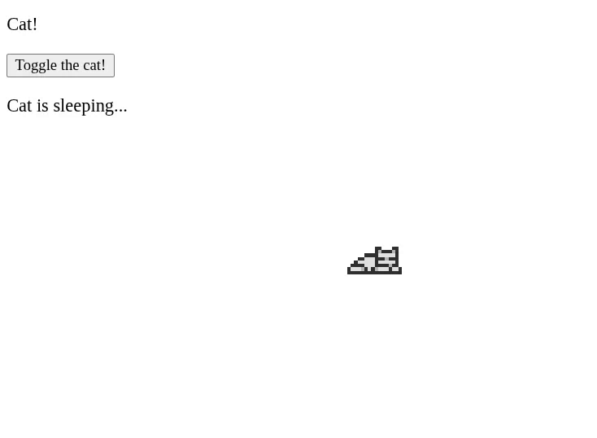

# The Cat™

It follows your cursor around. Can also lick his paw, clean his ear and sleep super hard. Press SHIFT to make it run faster!

## Built with

- HTML
- CSS
- TypeScript transpiled to JavaScript

## TODOs

- [ ] Maybe some better UI, CSS
- [ ] The focus point of cat is in top-left corner of the sprite, which looks bad if cursor is on the right. Can this be solved (without going crazy)?
- [ ] Maybe add some extra things for cat / user to do, like giving cat food or having some birds flying around that escape when cat runs next the them

## Credits for the amazing cat sprites

Taken from here: https://elthen.itch.io/2d-pixel-art-cat-sprites. Thank you!
